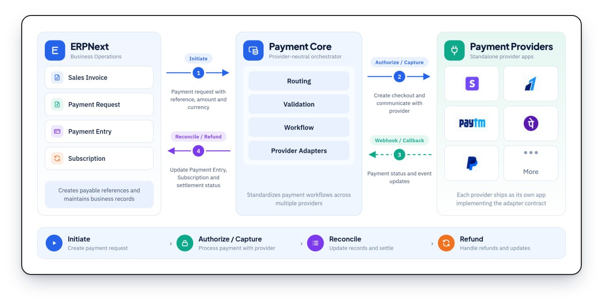

<div align="center">
<a href="https://integrations.frappe.cloud/integrations/payment-integration/payment-core/payment-overview">

</a>
<h2>Payment Core</h2>
<p>Provider-neutral payment infrastructure for Frappe and ERPNext</p>

[](https://github.com/aerele/payment-core/actions/workflows/ci.yml)
[](https://github.com/aerele/payment-core/actions/workflows/linter.yml)
[](license.txt)
</div>

<br>
<div align="center">

</div>
<br>
<div align="center">
<a href="https://integrations.frappe.cloud/integrations/payment-integration/payment-core/payment-overview">Documentation</a>
·
<a href="https://github.com/aerele/payment-core/issues">Report an Issue</a>
·
<a href="https://github.com/aerele/payment-core/pulls">Contribute</a>
</div>

## Payment Core

Payment Core provides the shared contracts and provider-neutral workflows used by payment gateway apps on Frappe. It integrates gateways with ERPNext payment records and Web Forms while keeping credentials, provider APIs, checkout interfaces, webhooks, and branding inside separate provider apps.

Payment Core is not a payment gateway and cannot accept payments on its own. Install a compatible provider app such as [Stripe Payment](https://github.com/aerele/stripe-payment) or [Razorpay Payment](https://github.com/aerele/razorpay-payment) to process transactions.

## Key Features

- **Gateway registry**: Register Payment Gateways and resolve their settings controllers consistently.
- **Controller contract**: Define a common interface and mixin for standalone gateway apps.
- **Secure references**: Validate payment references and resolve payable amounts and currencies from server-side records.
- **ERPNext settlement**: Authorize reference documents and settle Payment Requests without duplicating Payment Entries.
- **Web Form payments**: Add payment configuration to Web Forms and redirect successful submissions to the selected gateway.
- **Subscription dispatch**: Route subscription creation to handlers registered by provider apps.
- **Shared payment pages**: Provide common success, failure, and cancellation routes for checkout flows.

### Under the Hood

- [**Frappe Framework**](https://github.com/frappe/frappe): The full-stack framework on which Payment Core and provider apps run.
- [**ERPNext**](https://github.com/frappe/erpnext): Provides Payment Request, Payment Entry, and accounting workflows.
- [**Provider Apps**](https://github.com/aerele): Implement provider-specific checkout, credentials, APIs, webhooks, and reconciliation.

## Installation

Payment Core targets Frappe and ERPNext version 16 through `develop`. The current `develop` branch requires Python 3.14 or newer.

Set up a Frappe bench by following the [Frappe installation guide](https://docs.frappe.io/framework/user/en/installation), then install ERPNext and Payment Core:

```sh
bench get-app erpnext --branch develop
bench get-app https://github.com/aerele/payment-core --branch develop
bench --site <site-name> install-app erpnext
bench --site <site-name> install-app payment_core
```

Install the required provider app after Payment Core. Refer to that app's README for credentials, webhooks, and gateway-specific configuration.

## Building a Gateway App

A standalone provider app should:

1. Declare `required_apps = ["payment_core"]` in its hooks.
2. Implement a settings controller using `GatewayControllerMixin` and Frappe's `Document` class.
3. Provide `get_payment_url` and `validate_transaction_currency` methods.
4. Register its Payment Gateway with `payment_core.utils.create_payment_gateway`.
5. Use shared reference, amount, redirect, authorization, and settlement helpers where applicable.
6. Keep provider credentials, SDK clients, checkout pages, webhooks, and reconciliation inside the provider app.

See the [Payment Core documentation](https://integrations.frappe.cloud/integrations/payment-integration/payment-core/payment-overview) for the gateway architecture and integration workflow.

## Development

This app uses `pre-commit` for formatting and linting:

```sh
cd apps/payment_core
pre-commit install
```

Run the test suite with:

```sh
bench --site <site-name> run-tests --app payment_core
```

## Contributing

Contributions are welcome. Shared changes should remain provider-neutral and reusable across gateway apps. Before opening a pull request, please create or reference an [issue](https://github.com/aerele/payment-core/issues) and ensure the test suite and pre-commit checks pass.

## License

This project is licensed under the [MIT License](license.txt).
